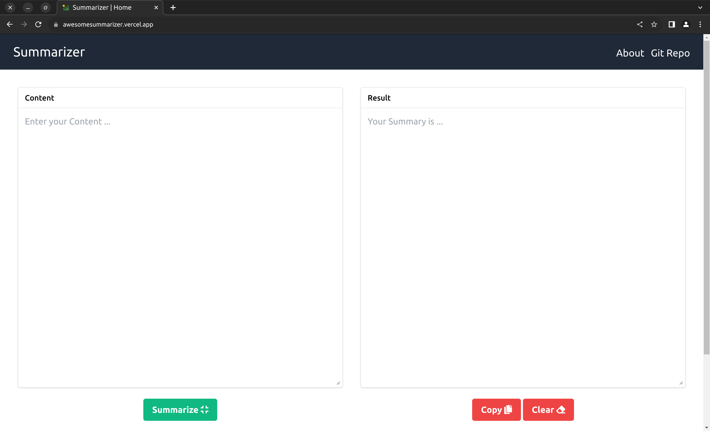

# Summarizer
Summarise your content on go ... 

## 📦 Tech Stack:

- [Flask](https://flask.palletsprojects.com/en/3.0.x/)  - Flask is a lightweight WSGI web application framework. It is designed to make getting started quick and easy, with the ability to scale up to complex applications.
- [Tailwind](https://tailwindcss.com/)  - Rapidly build modern websites without ever leaving your HTML.
- [Vercel](https://vercel.com/)  - Vercel's Front end Cloud provides the developer experience and infrastructure to build, scale, and secure a faster, more personalised Web.

## Demo:

<a href="https://awesomesummarizer.vercel.app/">

</a>


## Getting Started: 

- Clone repository 

```bash
mkdir ~/Dev/summarizer -p
cd ~/Dev/summarizer
git clone https://github.com/Arvind-4/summarizer .
```  

- Install Dependencies:

```bash
cd ~/Dev/summarizer
python3.8 -m pip install virtualenv
python3.8 -m virtualenv . 
source bin/activate
pip install -r requirements.txt
```

- Create  `.env`  file:
Add Your Credentials  `.env`  from  `sample.env`:

```bash
DEBUG=
SECRET_KEY=
```
Get your Secret key from:
```python
python3 -c 'import secrets; print(secrets.token_urlsafe(24))'
```

- Run Server:

```bash
cd ~/Dev/summarizer
bash commands/run.sh
```

Open [localhost:8000](http://localhost:8000) in your favourite browser :)
